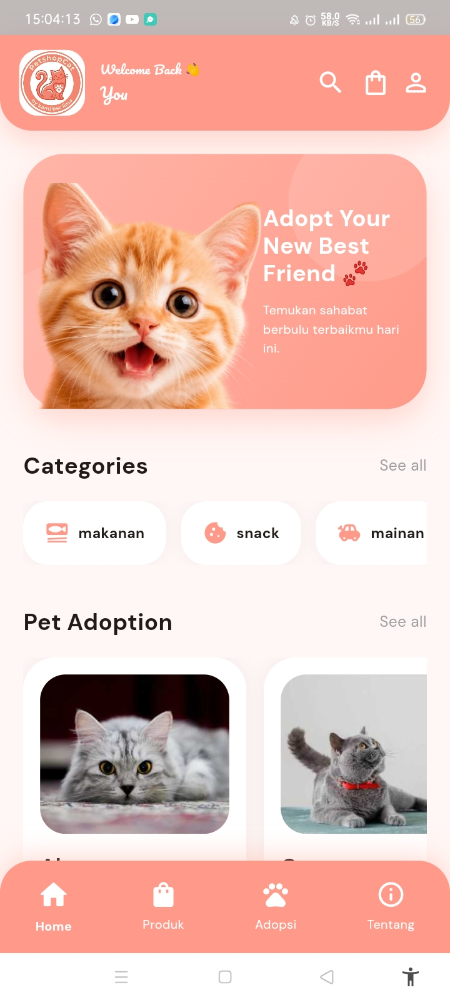

# PetshopCat - Aplikasi E-Commerce & Adopsi Kucing

**PetshopCat** adalah aplikasi mobile berbasis Flutter yang dirancang khusus untuk pecinta kucing. Aplikasi ini menyediakan layanan e-commerce untuk kebutuhan kucing (makanan, mainan, perawatan) serta platform adopsi kucing. Terdapat dua role utama: **User** (Pelanggan) dan **Admin** (Pengelola Toko).

Dibangun dengan integrasi penuh ke **Firebase**, aplikasi ini mendukung penyimpanan data secara realtime, autentikasi yang aman, dan upload gambar produk.

---

## ✨ Fitur Utama

### 👤 Role User (Pelanggan)
- **Autentikasi:** Halaman Register & Login menggunakan Firebase Auth.
- **Beranda:** Menampilkan banner promo, kategori dinamis, kucing adopsi, dan produk populer.
- **Katalog Produk:** Filter produk berdasarkan kategori, search produk, dan detail produk.
- **Keranjang & Checkout:** Tambah ke keranjang, checkout, dan data otomatis tersimpan ke Admin.
- **Adopsi Kucing:** Melihat list kucing yang siap diadopsi dan tombol langsung hubungi Admin via WhatsApp.
- **Profil:** Melihat dan mengedit data diri, serta tombol Logout.

### 🛠️ Role Admin (Pengelola)
- **Dashboard:** Menampilkan statistik realtime (Jumlah Produk, Kucing, User, Pesanan).
- **Manajemen Kategori:** Tambah dan hapus kategori produk.
- **Manajemen Produk & Kucing:** Upload data lengkap beserta foto (Disimpan dalam format Base64 di Firestore).
- **Manajemen User:** Melihat daftar pengguna terdaftar dan fitur Nonaktifkan/Aktifkan akun.
- **Manajemen Pesanan:** Melihat pesanan masuk, detail pesanan, dan status pesanan.

---

## 🛠️ Teknologi & Dependencies
- **Framework:** Flutter (Dart)
- **Backend & Database:** Firebase (Authentication, Cloud Firestore)
- **State Management:** StatefulWidget (Setstate)
- **Packages:** `google_fonts`, `image_picker`, `url_launcher`, `cloud_firestore`, `firebase_auth`, `firebase_core`

---

## 📂 Struktur Folder Project

Project ini diorganisir dengan rapi agar mudah dikerjakan secara tim (berlima). Berikut adalah struktur folder utama pada direktori `lib/`:

```text
lib/
├── main.dart                       # Entry point aplikasi
├── constants/
│   └── app_theme.dart              # Definisi warna tema (Peach #FF9A8A)
├── utils/
│   └── image_helper.dart           # Helper untuk render gambar Base64/URL
├── widgets/
│   ├── nav_item.dart               # Widget custom Bottom Navigation
│   ├── pet_card.dart               # Widget kartu kucing adopsi
│   └── product_card.dart           # Widget kartu produk
└── screens/
    ├── auth/
    │   ├── login_screen.dart       # Halaman Login (Cek role Admin/User)
    │   └── register_screen.dart    # Halaman Registrasi User baru
    ├── home/
    │   ├── home_screen.dart        # Halaman Utama User
    │   ├── search_screen.dart      # Halaman Hasil Pencarian
    │   └── profile_screen.dart     # Halaman Profil & Edit Data User
    ├── produk/
    │   ├── produk_screen.dart      # Katalog Produk & Filter Kategori
    │   └── cart_screen.dart        # Halaman Keranjang & Checkout
    ├── adopsi/
    │   └── adopsi_screen.dart      # Halaman Daftar Kucing Adopsi
    ├── profil/
    │   └── about_screen.dart       # Halaman Tentang Kami & Tim Developer
    └── admin/
        ├── admin_dashboard.dart    # Beranda Admin & Statistik
        ├── manage_category_screen.dart # Kelola Kategori Produk
        ├── manage_product_screen.dart  # Kelola Produk (List & Hapus)
        ├── add_product_screen.dart     # Form Upload Produk Baru
        ├── manage_cat_screen.dart      # Kelola Kucing (List & Hapus)
        ├── add_cat_screen.dart         # Form Upload Kucing Baru
        ├── manage_user_screen.dart     # Kelola Akun User (Aktif/Nonaktif)
        ├── manage_order_screen.dart    # Kelola Pesanan Masuk
        └── order_detail_screen.dart    # Detail & Invoice Pesanan
```

---

## 🚀 Cara Instalasi & Menjalankan Project

Untuk menjalankan project ini di komputer lokal Anda, ikuti langkah-langkah berikut secara berurutan.

### 1. Prasyarat (Yang harus diinstall)
- [Flutter SDK](https://docs.flutter.dev/get-started/install) (Versi 3.0.0 atau lebih baru)
- [Android Studio](https://developer.android.com/studio) atau [Visual Studio Code](https://code.visualstudio.com/)
- Akun [Firebase Console](https://console.firebase.google.com/) (Gratis)
- Emulator Android/iOS atau Perangkat Fisik (HP) dengan Mode Developer Aktif.

### 2. Clone Repository
Buka terminal/command prompt, lalu jalankan perintah berikut:
```bash
git clone https://github.com/USERNAME_KAMU/petshopcat-app.git
cd petshopcat-app
```
*(Ganti `USERNAME_KAMU` dengan username GitHub kalian)*

### 3. Install Dependencies
Jalankan perintah ini di dalam folder project untuk mendownload semua package yang dibutuhkan:
```bash
flutter pub get
```

### 4. Setup Firebase
Karena project ini menggunakan database Firebase, Anda harus membuat project Firebase sendiri:
1. Buka [Firebase Console](https://console.firebase.google.com/), klik **Add Project**.
2. Daftarkan aplikasi Android/iOS dan download file konfigurasi:
   - Android: `google-services.json` (Letakkan di folder `android/app/`)
   - iOS: `GoogleService-Info.plist` (Letakkan di folder `ios/Runner/`)
3. Di Firebase Console, aktifkan layanan berikut:
   - **Authentication**: Aktifkan metode sign-in Email/Password.
   - **Cloud Firestore**: Buat database, aturan (rules) sementara di-set ke `allow read, write: if true;` untuk testing.
4. Buat collection awal di Firestore:
   - `categories` (fields: `name` string, `createdAt` timestamp)
   - `users` (Buat 1 document manual untuk Admin. Gunakan UID dari Authentication, lalu tambahkan field: `role` string = "admin", `name`, `email`).

### 5. Jalankan Aplikasi
Pastikan emulator sudah menyala atau HP sudah terhubung via USB. Jalankan perintah:
```bash
flutter run
```

---

## 📸 Screenshot Aplikasi
*Anda bisa menambahkan gambar tampilan aplikasi di sini menggunakan format berikut:*

<table>
  <tr>
    <td></td>
    <td></td>
    <td></td>
  </tr>
  <tr>
    <td align="center">Halaman Beranda</td>
    <td align="center">Halaman Produk</td>
    <td align="center">Dashboard Admin</td>
  </tr>
</table>


## 👥 Tim Pengembang (Kelompok 5)

Project ini dikerjakan secara kolaboratif oleh tim **"Kami Ber Lima"** sebagai tugas mata kuliah Mobile Programming:

| Nama | NIM | Peran / Tugas |
| --- | --- | --- |
| **Miftah** | 19241515 | Halaman Adopsi & Integrasi WhatsApp |
| **Asna** | 19241781 | Halaman Tentang (About) & Tim List |
| **Nafisah** | 19242053 | Halaman Beranda (Home) & Search |
| **Niken** | 19240691 | Halaman Login, Register & Backend |
| **Teguh** | 19240174 | Dashboard Admin, Produk & Integrasi Firebase dan menyatukan semuanya |

---
© 2026 PetshopCat. Dibuat menggunakan Flutter.
